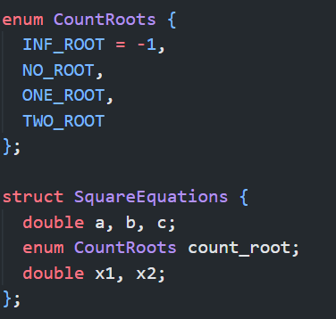
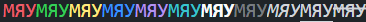
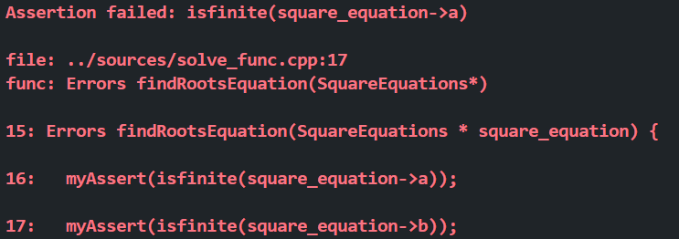

## Проект по решению квадратных уравнений

Это начальная стадия проекта (возможно) по решению совершенно различных уравнений на основе математических алгоритмов. На данный момент программа предназначена для решения квадратных уравнений и их вырожденных случаев без обобщения на комплексные числа.

## Реализация

Проект состоит из `make` файла, который в 1 клик собирает программу в исполняемый файл и сохраняет его (и объектные файлы) в папке `build`, также из файлов с кодом в папке `sources` и объявлений функций и констант в соответствующих файлах папки `headers`.

## Тонкости реализации

В программе объявлена структура уравнения (пока что только квадратного), содержащая в себе коэффициенты `a, b, c`, количество корней, объявленное через `enum` для большей читаемости, и сами корни `x1, x2`.



## Ключевые функции

### Функции для решения уравнения

- `findRootsEquation` - общая функция для решения уравнений, определяющая его тип и перенаправляющая в соответствующую функцию.
- `findRootsLinearEquation` - функция, предназначенная для решения линейных уравнений.
- `findRootsSquareEquation` - функция, предназначенная для решения квадратных уравнений.
- `compareDoubles` - функция для корректного сравнения чисел типа `double` с нулем.

### Функции тестирования

- `testFindRootsEquation` - основная функция тестирования `findRootsEquation`.
- `test` - вспомогательная функция, сравнивающая ответы.

### Функции ввода вывода

- `mainCycle` - функция циклической обработки ввода для возможности подсчета решений нескольких уравнений без перезапуска.
- `parseConsoleArg` - обработка дополнительных аргументов командной строки.
- `inputCoeff` - функция ввода коэффициентов `a, b, c`.
- `inputParse` - функция обработки некорректного ввода.
- `printRootsEquation` - функция вывода корней уравнения.
- `errorsParser` - функция, обрабатывающая ошибки в процессе выполнения программы.

### Кастомный вывод

В проекте реализована кастомная функция `colorPrintf` меняющая стандартный цвет и шрифт вывода.


### Кастомный `assert` `myAssert`

Он выводит не только файл, функцию и номер строки с ошибкой но и строку с предыдущей и следующей после нее красным жирным шрифтом.



### Дополнительный флаг

При запуске `make` есть возможность добавить флаг `TEST_FLAG=ON`, который скомпилирует также юнит тесты и сделает возможным предварительную проверку программы.

## Как использовать

Для сборки и запуска проекта введите в консоль набор команд:

```
make
cd build
./main --help
```

Или в сокращенном варианте:

``` make; cd build; ./main --help ```

Для дальнейшего перезапуска достаточно ``` ./main ```

## Перспективы

Обобщение на более сложные уравнения и дальнейшее развитие (возможно).
